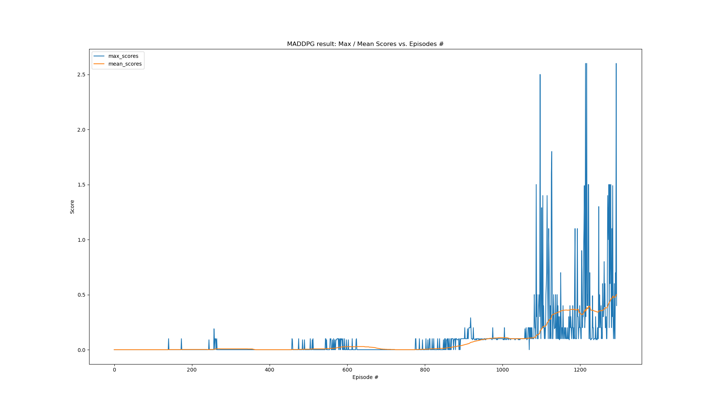
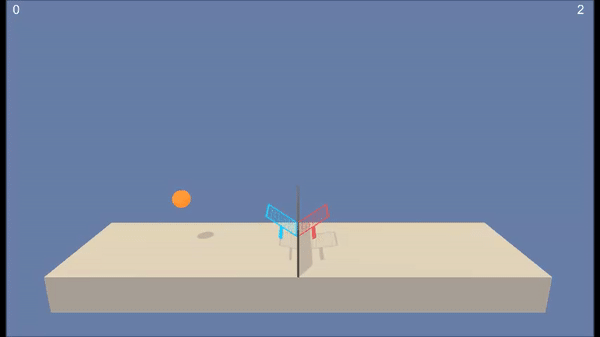
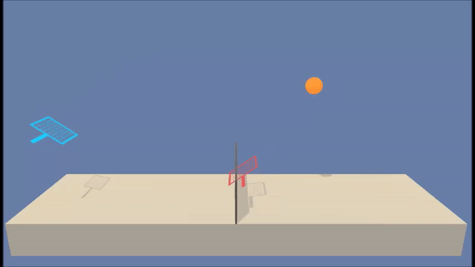

# Report

This report discusses the points listed below in greater detail:

1.  The MADDPG-Algorithm
    1. The Algorithm
    1. The Learning Process
        1. Critic
        1. Actor
        1. Update-Rule
    1. Deviations to the original MADDPG-algorithm
2.  Empirical Results
    2.  Score-vs-Episode-Plot
    2.  GIFs showing
        2.  the agent's performance **before** training 
        2.  the agent's performance **after** training        
3.  Implementation
    3.  Neural Network Architectures
        3. Critic
        3. Actor
    3.  Hyperparameters
4.  Possible Future Improvements
    4.  Prioritised Experience Replay
    4.  GAE: Generalized Advantage Estimation
    4.  True MADDPG
    4.  Policy Ensembles

## The MADDPG-Algorithm

The **MADDPG-algorithm (Multi-Agent Deep Deterministic Policy Gradient)** is described in the paper [R. Lowe et al. "Multi-Agent Actor-Critic for Mixed Cooperative-Competitive Environments"](
http://papers.nips.cc/paper/7217-multi-agent-actor-critic-for-mixed-cooperative-competitive-environments.pdf) by OpenAI back in 2017, was published at the NIPS (Neural Information Processing Systems) 2017 conference (now NeurIPS) and is *used here in an adapted version*.

**MADDPG is an approach in deep reinforcement learning that effectively adapts the ideas of the Deep Deterministic Policy Gradient (DDPG) method towards environments interacting with a bunch of independent (collaborative or competitive) agents**.

The underlying DDPG-algorithm brings together the ideas from DQN and Actor-Critic methods. It was discussed in some more detail in our previous project that is part of the **Udacity Deep Reinforcement Learning Nanodegree** program and can be found [here](https://github.com/4SafeAI/Deep_Deterministic_Policy_Gradient_for_Unity_Reacher_Env).

However, we will also elaborate a bit more on the MADDPG-algorithm itself as we did on other methods in the previous projects:

### The Algorithm

**The MADDPG-algorithm itself expands the ideas mentioned in the paper ["Continuous Control with Deep Reinforcement Learning" by Timothy R. Lillicrap et al.](http://arxiv.org/abs/1509.02971) from Deepmind back in 2016  and is a representative of an actor-critic method that is composed of several components ([see here for more information](https://github.com/4SafeAI/Deep_Deterministic_Policy_Gradient_for_Unity_Reacher_Env)):**

The MADDPG-algorithm is based upon the following three constraints / desiderata:
1. **The learned policies (i.e. agents) can only use local information (i.e. their own observations of the environment) at execution time.**
2. **The model of the environment dynamics does not have to be differentiable.**
3. **No particular communication protocol between agents is assumed.**

Moroever, the algorithm is based on a framework of centralized training with decentralized execution. These two terms can be understood as follows:

**Centralized training / Decentralized execution: The critic is allowed to make use of additional information at training time, so long as this information is not used at test time.**

Therefore, on the one hand every single agent among the set of N agents has its own actor network that only has access to the agent's local observations. On the other hand every agent has its own critic network, that, other than the actor, has access to all agents' observations, policies and actions. The latter is compliant with the framework of centralized training / decentralized execution.   

**The MADDPG-algorithm itself works as follows:**

1. Initialize N separate agents with separate sets of trainable critic and actor networks with random weights, respectively.
2. Initialize two target networks per agent, one for the local (i.e. trainable) critic and one for the corresponding actor. These can be just copies of the untrained critic and actor networks created in the first step.
3. The four networks per agent created in steps 1 & 2 are input to the MADDPG-algorithm.
4. Initialize a single replay buffer for experience collection & replay (comprising experiences of **all** agents).
5. A major challenge of learning in continuous action spaces is exploration. Therefore, for every new episode initialize a random process for action exploration (per agent), like an *Ornstein-Uhlenbeck* process, for example, to generate temporally correlated exploration. The output from the random process is added to an agent's prescribed action.
6. Each agent applies an action to the environment and receives its own observation, like new state and reward, and the <state, action, reward, next_state>-tuples per agent are stored in the replay buffer.
7. During interaction with the environment, make the agents learn from minibatch-experiences sampled from the replay buffer and update every agent's critic and actor networks separately. The sampled experiences comprise experiences for every agent, such that all agents can be trained simultaneously.
8. Repeat steps 5. to 7. until convergence. 

The learning process itself is explained in the following and is exemplified for a single agent:

### The Learning Process

#### Critic

After we've collected enough experiences (i.e. <state, action, reward, next_state>-tuples) we first start updating the critic. 

This is achieved by sampling some of our experiences and then computing the empirically observed estimates of the <state, action>-values compared to those estimated from the critic. 
The empirically observed estimates are calculated by, first, estimating the next action via the target actor model applied to the next state. This estimate for the next action is then used in a second step to calculate an estimate for the empirically observed <state, action>-value itself using the target critic model applied to the tuple consisting of the next state and the estimated next action from the previous step.
 
The difference between the empirically observed estimate of the <state, action>-value and its direct estimate from the actual critic model is known as the TD-error. 
Subsequently, the critic's model weights are updated in such a way as to reduce this error via the backpropagation-algorithm. 
The whole procedure is then repeated iteratively, effectively reducing the error over time until convergence is achieved.

#### Actor

The actor, by contrast, is optimized by calculating the *sampled policy gradient*. The latter is given as the gradient of the expected return from the start distribution with respect to the **actor's** parameters. To be more precise, it can be calculated as the gradient of the trainable critic model with respect to the actor's model weights. Then an average value of this gradient is calculated for the minibatch of samples experiences from the replay buffer.
Subsequently, the actor's model weights are updated in such a way as to reduce this error via the backpropagation-algorithm, as we did for the critic. 
The whole procedure is then repeated iteratively, effectively reducing the error over time until convergence is achieved.

#### Update-Rule

At the end of each timestep, the target networks are updated in a way that is known as *soft-updates*. This means, that only a TAU-th proportion of the trainable and recently updated model weights are added to the target model weights at the expense of the target model weights, which themselves have been rescaled by (1-TAU).

**A list of more refined versions of the MADDPG-algorithm can be found in the *"Possible Future Improvements"*-section together with brief descriptions**.

### Deviations to the original MADDPG-algorithm

In our version of the MADDPG-algorithm, we implemented a **self-play-agent** instead of two separate agents. The self-play-agent is composed of one actor- and one critic-network that are in charge of controlling **both** sides of the Tennis environment and substitutes the two agents that would have been used otherwise. Consequently, unlike in the original MADDPG-algorithm, we do not have two agents learn their own policy and state-action-values on their own using two separate sets of critic- and actor-networks. Here, we decided to teach one single set thereof, as we deal with a collaborative environment, in which two agents can only achieve high scores, if every single agent performs well.

## Empirical Results

**As mentioned earlier, we implemented the original MADDPG-algrothm slightly differently and, additionally, made use of gradient norm clipping to 1 (in case of the local critic network) in order to make training more stable. Empirically we found that the application of gradient norm clipping in case of the actor network deteriorates the overall training performance. So we skipped it for the actor.**

Below, you find some empirical results for our adapted version of the MADDPG-algorithm.

### Score-vs-Episode-Plot

We found that after 1195 episodes, the agent can be considered to have 'solved' the environment as it attained an average score of +0.5 over 100 episodes (orange curve).

A plot of score vs episode is shown below:

### GIFs showing

#### the agent's performance before training

#### the agent's performance after training

## Implementation

### Neural Network Architectures

Overall, we chose standard fully-connected, feed-forward neural networks with the following parameters for the critic and the actor, respectively:

#### Critic

1.  Input layer consisting of 52 neurons ( num_agents * (3 * timesteps * state_size + action_size) = 2 * (3 * 8 + 2)) concatenated neurons).
    1. 24 neurons thereof (per agent) represent the 8-dimensional state vector input to our critic network over a time horizon of 3 timesteps.
    1. 2 neurons thereof (per agent) represent the 2-dimensional action vector input to our critic network.
2.  Two hidden layers with 64 neurons and with ReLU-activation function, each, and with one single BatchNormalization layer between them.
3.  One single output layer with 1 neuron (per agent) representing the value of the (state, action) tuple with no (i.e. linear) activation function (the output can take on both positive and negative values.)

#### Actor

1.  Input layer consisting of 24 neurons simply representing the 8-dimensional state vector input to our actor network over a time horizon of 3 timesteps.
2.  Two hidden layers with 64 neurons and with ReLU-activation function, each, and one BatchNormalization layer after every hidden layer.
3.  One single output layer with 2 neurons representing the 2-dimensional action vector with tanh activation function (per agent). The latter is necessary to bound the action values to values between -1 and 1.

### Hyperparameters

Here, we would like to discuss the hyperparameters occurring in the MADDPG-algorithm briefly:

**max_episodes (int): maximum number of training episodes**\
We chose 2000 episodes.

**GAMMA (float): discount rate**\
A value close to 1 will make the agent weight future rewards as strongly as immediate rewards, while a value close to 0 will make the agent only focus on immediate rewards. Here, we chose gamma to be 0.99.

**LR_ACTOR (float): model hyperparameter - learning rate**\
This determines the magnitude of actor model weight updates. If chosen too large a value, then the learning is likely to become unstable, while chosen too small a value, the model may never converge. Therefore, we chose LR_ACTOR to be 1e-3, which is a more or less common choice in Deep Learning.

**LR_CRITIC (float): model hyperparameter - learning rate**\
This determines the magnitude of critic model weight updates. If chosen too large a value, then the learning is likely to become unstable, while chosen too small a value, the model may never converge. Therefore, we chose LR_CRITIC to be 2e-3, which makes the critic learn a bit faster than the actor.

**BATCH_SIZE (int): model hyperparameter - number of experiences sampled for a model minibatch**\
Too low will cause learning instability and poor convergence, too high can cause convergence to local optima. Here, we chose 256 as batch size.

**BUFFER_SIZE (int): replay buffer size**\
this is the size of the experience buffer and represents the size of the memory the agent can sample from for learning. Here, we chose a buffer size of 1E6.

**TAU (float): how closely shall the target network follow the current network in terms of weights?**\
After every learning step, the target-network weights get updated with a fraction tau of the current network weights. Therefore, the target-network weights are a moving average over time of the current network weights. Here, we chose a value of 3e-3.

## Possible Future Improvements

The following list of modifications and refined approaches may render themselves beneficial for obtaining even better performance than obtained with the adapted version of the MADDPG-algorithm presented and implemented here:

### Prioritised Experience Replay

In order to produce training data we store all <state, action, reward, next_state>-tuples as experiences and then sample them randomly each time we update the model. Note, that some of these may be more valuable for learning than others. For instance, an agent may have plenty of experiences from the starting state but relatively little from more rare states. In this modification we use how 'surprising' an observed <state, action>-value is as a measure of how 'useful' learning from it is. Formally, this usefulness can be modeled by the absolute difference between the value we observed for it (i.e. the target value) and the value our model assigns to it (i.e. the estimated value).

Read more: https://arxiv.org/abs/1511.05952

### GAE: Generalized Advantage Estimation

The quality of the critic's estimate of the <state, action>-value is believed to increase, as we increment the step width of the n-step-bootstrapping approach. 
As discussed in the paper below, the *GAE: Generalized Advantage Estimation*-approach promises to tackle all different versions of n-step-bootstrapping at once just by forming a mixture of exponentially decaying factors across the different n-step bootstrapping estimates. This is done by adjusting another hyperparameter, called *lambda*. 
The mixture is taylored such that for *lambda = 0* it is equivalent to the TD-estimate, that is biased, whereas for *lambda = 1* it reproduces the Monte-Carlo-estimate, that is completely unbiased.

Read more: https://arxiv.org/abs/1506.02438

### True MADDPG

Having a single set of actor- and critic-networks learn the policy of both sides can be very restrictive in finding the best policy for every side of the Tennis environment. This can be attributed to the fact that the single set of actor- and critic-networks has to be flexible enough to adjust to both sides. Thus, the single set of networks is prevented from focusing on a single side exclusively. Consequently, we believe that two separate sets of networks are more advantageous to solving the Tennis environment because every single agent is relieved from performing well for both sides.

Read more: https://arxiv.org/abs/1506.02438 

### Policy Ensembles

As stated in the paper below (section 4.3), having agents learn with policy ensembles can circumvent problems (like overfitting policies) that are associated with the non-stationarity in multi-agent reinforcement learning environments due to the agent's changing policies. In order to obtain more robust multi-agent policies, one could try to learn an ensemble of K different sub-policies. There, a random sub-policy is sampled from the ensemble for training at each episode.

Read more: https://arxiv.org/abs/1506.02438